### Análisis Experimental y Evaluación Clínica

**1\. Curación de Datos**

Durante el Análisis Exploratorio de Datos (EDA) se detectó una filtración crítica (_Data Leakage_) por imágenes duplicadas entre los conjuntos de entrenamiento y validación, afectando especialmente al total de la muestra de validación en _Atopic Dermatitis_. Para salvaguardar la integridad metodológica, se removieron estos duplicados y se reconstruyó la partición de la clase _Atopic Dermatitis_, extrayendo al azar el 20% de las muestras limpias de entrenamiento. La distribución final quedó balanceada en 100 muestras (80 train / 20 val) para siete de las clases (_Actinic keratosis_, _Benign keratosis_, _Dermatofibroma_, _Melanocytic nevus_, _Melanoma_, _Vascular lesion_ y _Squamous cell carcinoma_), mientras que _Atopic Dermatitis_ se fijó en 81 muestras (65 train / 16 val) y _Tinea Ringworm Candidiasis_ en 64 (56 train / 8 val), estableciendo un suelo crítico de solo 8 imágenes en validación.

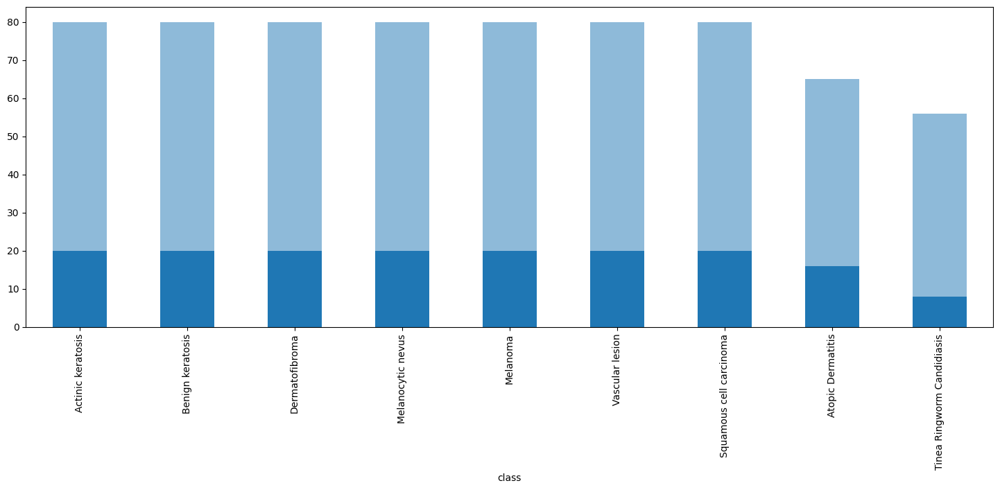

**2\. Análisis Dimensional**

El perfil de resoluciones espaciales originales muestra una marcada heterogeneidad dentro del dataset. Aunque la moda estadística se sitúa dominantemente en dimensiones de 600×450 píxeles, la distribución exhibe una cola larga (_long tail_) de dimensiones dispersas que descienden hasta estructuras mínimas de 72×137 píxeles. Dado que las restricciones de cómputo en CPU obligan a reducir el tamaño de entrada de los vectores, y considerando que un Perceptrón Multicapa (MLP) carece de invarianza espacial debido a que procesa la información de forma aplanada y lineal, este escenario plantea dos fenómenos geométricos contrapuestos.

Por un lado, se produce una pérdida severa de características microscópicas por compresión directa. Al estandarizar las entradas a resoluciones bajas de 32×32 o 64×64 píxeles, las imágenes de alta resolución sufren un _downsampling_ extremo. En el diagnóstico diferencial entre _Melanocytic nevus_ y _Melanoma_, esta reducción destruye los criterios clínicos de la Regla ABCD, ya que los bordes (B) y las variaciones cromáticas (C) se promedian aritméticamente, perdiendo su definición geométrica. Asimismo, el diámetro (D) queda técnicamente anulado debido a la falta de una escala métrica real y a que el redimensionamiento estira las lesiones para ocupar una proporción fija en el lienzo, forzando a la arquitectura MLP a depender casi exclusivamente de la asimetría global (A) y del tono cromático promedio del tejido. Por otro lado, se introduce el riesgo de incorporar artefactos morfológicos por estiramiento. Las imágenes originales con dimensiones inferiores al tamaño objetivo experimentarán un _upsampling_ artificial, introduciendo pixelado y patrones geométricos repetitivos que las capas completamente conectadas de la red corren el riesgo de memorizar.

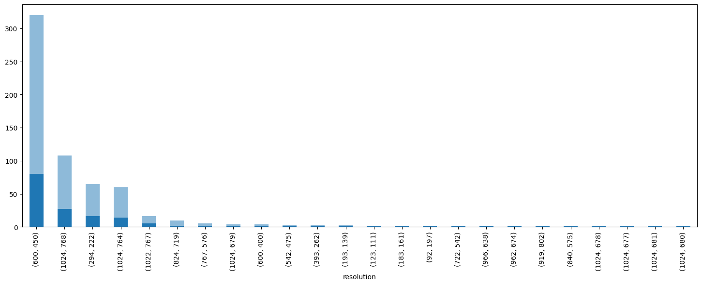

**3\. Análisis Cualitativo**

La inspección visual expone severas vulnerabilidades vinculadas a la naturaleza lineal de la MLP. En primer lugar, se detectó un "_Contextual Leakage_" dado que _Atopic Dermatitis_ presenta fotografías clínicas macroscópicas con fondos heterogéneos de habitaciones, mientras que las clases tumorales y vasculares emplean capturas dermatoscópicas estandarizadas en marcos circulares cerrados; al aplanar las matrices, los píxeles periféricos adquieren el mismo peso matemático, arriesgando que el modelo clasifique la técnica fotográfica en lugar de la etiología. En segundo lugar, se enfrenta la dualidad entre patrones fuertes y ruido estocástico; mientras que las firmas macroscópicas de _Vascular lesion_ (tonos magenta) y _Candidiasis_ (patrón anular) resultan inmunes al _downsampling_, la presencia de vello denso y reflejos ópticos en _Dermatofibroma_ actúa como ruido que el sistema podría correlacionar erróneamente como características patológicas.

**4\. Fundamentación del Universo de Hiperparámetros**

Las restricciones distributivas, espaciales y cualitativas analizadas previamente fundamentan de manera directa la composición y delimitación de la grilla de búsqueda por fuerza bruta mediante _Random Search_. En cuanto a la estrategia de redimensionamiento (resize*strategy), se introdujo la comparación formal entre la compresión directa (\_Resize*) y la preservación de la relación de aspecto original mediante "_LongestMaxSize + PadIfNeeded"_, permitiendo evaluar matemáticamente qué técnica mitiga mejor la distorsión morfológica de las fronteras de las lesiones. Para los mecanismos de aumentación de datos (_Data Augmentation_ como _Rotate_, _Shift_, _HFlip_, _VFlip_), el mapeo de posiciones en píxeles fijos obligó a incluir rotaciones aleatorias y traslaciones con el fin de forzar a la MLP a generalizar formas independientemente de su alineación y descentrado. Se restringió drásticamente la alteración cromática (_color jittering_) para salvaguardar la firma espectral nativa de las lesiones vasculares.

Respecto a la complejidad arquitectónica (hidden*layers) y con el fin de resolver el solapamiento de las manchas oscuras pixeladas en la frontera de \_Nevus* contra _Melanoma_, se justificó la evaluación de topologías profundas (como la configuración \[512, 128\] con funciones de activación ReLU) capaces de proyectar los vectores colapsados hacia hiperplanos de mayor dimensión linealmente separables, reservando las redes superficiales (\[128\]) como línea base para capturar firmas cromáticas elementales. También, se requirió la regularización matemática (dropout, weight*decay) debido al bajo volumen de entrenamiento en las excepciones muestrales (\_Atopic Dermatitis* con 65 muestras y _Candidiasis_ con 56), obligando a incluir tasas de _Dropout_ de hasta el 0.2 y penalizaciones L2 para mitigar la memorización de los sesgos del fondo fotográfico.

Finalmente, se estableció un criterio de evaluación dual: operativamente, se mantuvo el _Accuracy_ de validación como la métrica única en el código para la ejecución del _Early Stopping_ y el almacenamiento de los pesos para respetar el diseño base del algoritmo; no obstante, el desbalance remanente en la validación de _Candidiasis_ y el riesgo clínico de confusiones cruzadas dictaminaron que la selección final del mejor modelo se auditaría a posteriori mediante el **Macro F1-Score** y el **Recall** provistos por el reporte de clasificación.

**5\. Metodología de Exploración del Espacio de Búsqueda**

A partir de la grilla de hiperparámetros definida por las restricciones morfológicas y cualitativas del dataset, el espacio combinatorio global ascendió a un total de 4,608 configuraciones posibles de modelos. Dadas las limitaciones de cómputo y con el propósito de optimizar los recursos disponibles, se implementó una estrategia de exploración estocástica a "fuerza bruta" mediante un algoritmo de _Random Search_. Bajo este enfoque, se extrajo y entrenó de forma aleatoria una muestra representativa equivalente al 10% de dicho universo, consolidando la ejecución de 470 experimentos independientes cuya convergencia térmica y estadística permite caracterizar con alta fidelidad el comportamiento del sistema. Cabe destacar que tanto los scripts para el entrenamiento, como los registros estructurados con los resultados obtenidos se encuentran disponibles para su consulta dentro de este mismo repositorio.

### Resultados y Dinámica del Espacio de Búsqueda

**1\. Exploración Global**

El análisis macroscópico mediante un diagrama de dispersión entre el _val_accuracy_ y la brecha de sobreajuste (_overfitting_gap_) reveló una alta concentración de experimentos en el rango del 45% al 63% de exactitud en validación. La práctica ausencia de modelos con rendimientos cercanos al azar convalida el acotamiento de la grilla. Un volumen significativo de arquitecturas eficientes (55%-63%) exhibió brechas negativas (Gap<0), Si bien una brecha negativa en niveles bajos de exactitud puede sugerir un subajuste (_underfitting_) prematuro inducido por la detención temprana (_Early Stopping_), la concentración de estos puntos en los rangos más altos de rendimiento (55%−63%) tiende a mitigar esta hipótesis de manera generalizada. Este fenómeno podría responder, en cambio, a la asimetría de dificultad entre los conjuntos: el proceso de aumentación estocástica (Albumentations) complejiza el espacio de aprendizaje en el entrenamiento, forzando a la red a extraer características robustas. Al evaluar el modelo sobre el conjunto de validación (exento de perturbaciones), este suele exhibir una capacidad de generalización optimizada, reflejándose en una brecha matemática negativa. No obstante, se evidenció un techo de convergencia asintótico en torno al 65% de precisión global, donde los modelos que intentaron superar este límite sufrieron un incremento lineal en su inestabilidad y sobreajuste.

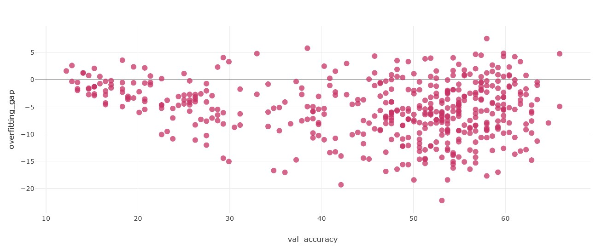

Para aislar las variables de ingeniería detrás de las configuraciones óptimas, se aplicó un filtro por embudo restringiendo el estudio a modelos con un val_accuracy≥55.5% y un sobreajuste controlado entre el 0% y el 5%. El análisis de coordenadas paralelas confirmó la coexistencia de dos perfiles definidos: un modelo líder singular que alcanza el rendimiento absoluto del experimento (65.85%) operando en el límite de su estabilidad con una brecha cercana al 5%, y un denso pelotón de coherencia situado entre el 58% y el 63.5% de precisión, caracterizado por brechas compactas confinadas entre 0.0 y 3.0, representando la región de diseño más robusta del espacio de búsqueda.

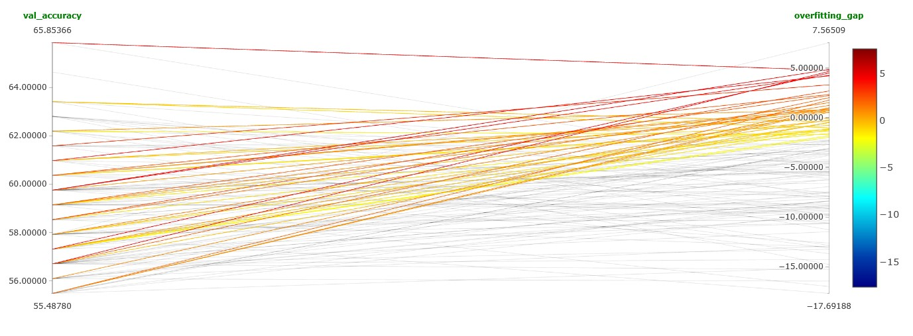

**2\. Influencia de las Variables de Diseño**

Al aislar el impacto de las variables individuales mediante el análisis de coordenadas paralelas, se identificaron los siguientes patrones concluyentes:

- **Factor de Desplazamiento Espacial (Shift):** La ausencia total de traslación (Shift = 0.0) favoreció unánimemente a los rendimientos más competitivos, mientras que los desfasajes del 30% degradaron la convergencia al alterar la consistencia geométrica que la MLP requiere en píxeles fijos.

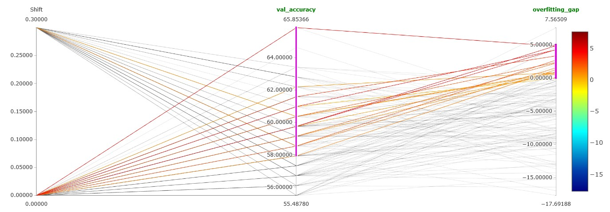

- **Complejidad Arquitectónica (hidden_layers):** La topología profunda \[512, 128\] consolidó el máximo rendimiento absoluto (65.85%) debido a su alta expresividad matemática, aunque a costa de una mayor varianza. Por el contrario, la variante monocapa \[128\] estabilizó homogéneamente sus modelos en el rango del 58%-62% con brechas controladas, emergiendo como una alternativa más robusta.

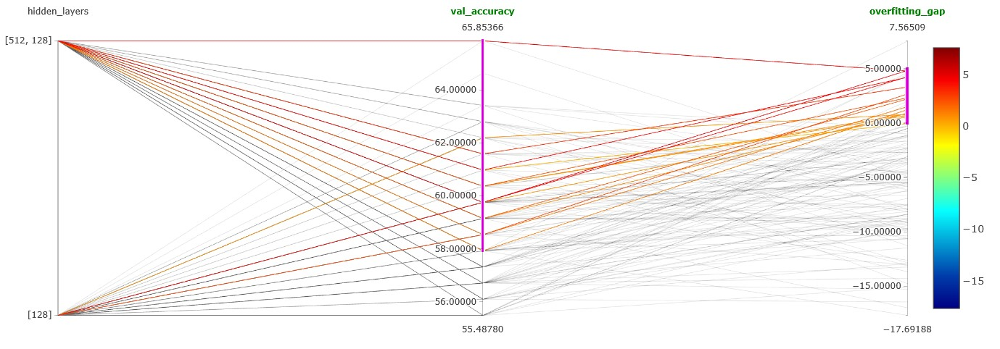

- **Dimensión de Entrada (input_size):** Contraintuitivamente, el modelo óptimo absoluto emergió de una resolución reducida de 64×64 píxeles, mientras que el pelotón de alta eficiencia se distribuyó equitativamente entre las dimensiones de 64 y 128. Trabajar con vectores pequeños redujo el ruido por píxel y los parámetros ponderados, actuando como un regularizador implícito.

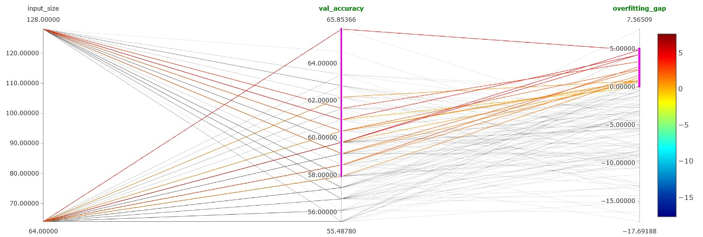

- **Tamaño de Lote (batch_size) y Optimización:** Excluyendo al líder absoluto entrenado con lote de 16, las soluciones óptimas se distribuyeron de manera simétrica entre lotes pequeños (16) y grandes (64), Esta paridad numérica sugiere que el tamaño del lote no operó como un factor crítico ni condicionante para la convergencia del pipeline en la zona de alta generalización. En las condiciones estocásticas del experimento, tanto la dinámica de gradientes más suaves y estables de un lote mayor (64) como el régimen de mayor exploración por ruido térmico de un lote menor (16) demostraron una aptitud matemática equivalente para guiar a las redes hacia mínimos locales de similar calidad. Respecto al algoritmo, existió paridad absoluta en el pelotón estable entre SGD y RMSprop, diferenciándose únicamente en que este último logró el pico aislado del modelo outlier.

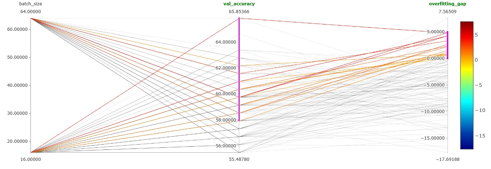

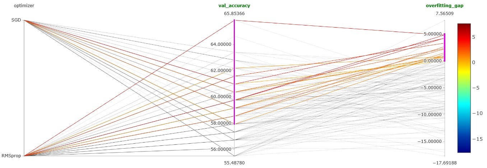

- **Tasa de Aprendizaje (lr):** El sistema exhibió una polarización absoluta hacia el extremo inferior, convergiendo los modelos eficientes principalmente en la tasa mínima de 0.00010. Las configuraciones que exploraron valores cercanos al límite superior (0.01) sufrieron una degradación sistémica en la validación o fueron descartadas de forma automática por exceder las cotas de sobreajuste permitidas.

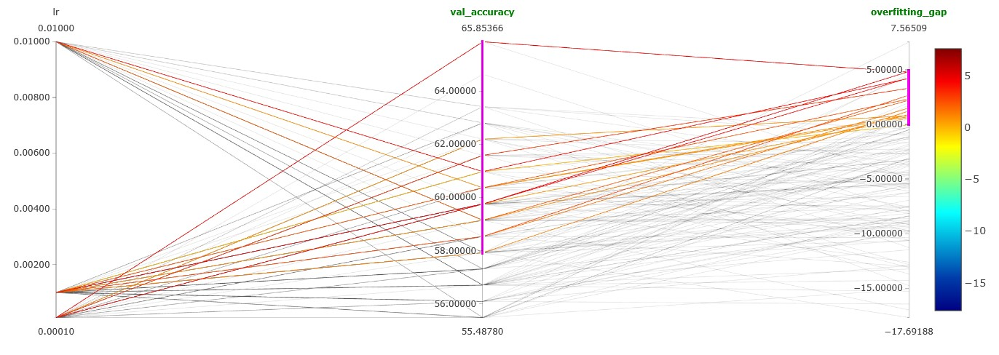

- **Estrategia de Redimensionado (resize_strategy):** Se constató una ventaja contundente a favor de la preservación de la relación de aspecto mediante padding_pr. El estiramiento directo (direct_res) alteró las proporciones reales de las lesiones e introdujo distorsiones morfológicas que confundieron a las redes de forma generalizada.

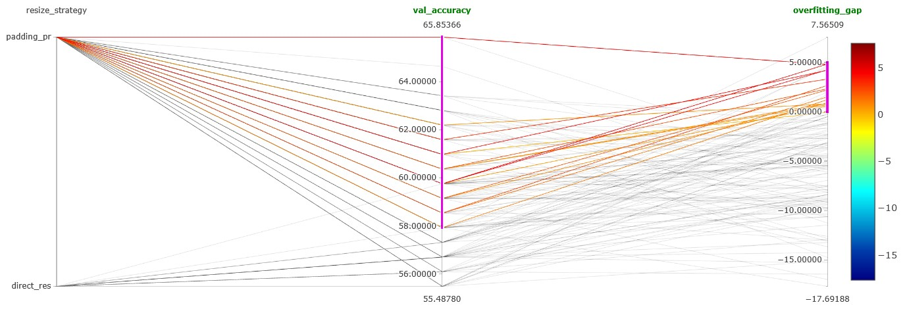

- **Regularización (Weight Decay y Dropout):** Se identificó una marcada ventaja al prescindir de regularizadores internos excesivos. El modelo de máxima precisión se consolidó con un decaimiento sutil de 0.00010 y un Dropout = 0.00000. Las tasas de abandono del 20% redujeron drásticamente la capacidad de aprendizaje en capas ocultas compactas, interfiriendo negativamente en la convergencia debido a que el pipeline ya se encontraba fuertemente regularizado de forma externa por _Albumentations_.

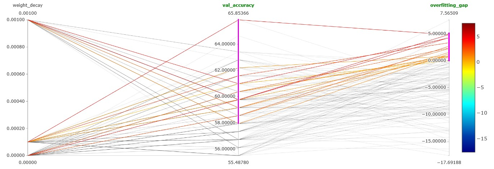

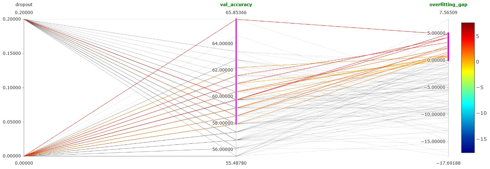

### Selección de Modelos

**1\. Análisis Comparativo de Modelos Candidatos**

A partir de las restricciones del embudo experimental, se aislaron tres configuraciones representativas para someterlas a una inspección de sus reportes por clase y matrices de confusión:

- **Candidato 1: El Modelo Outlier (Máximo Rendimiento Absoluto):** Con un val*accuracy=65.85%, un overfitting_gap=4.77% y un \_Macro F1-Score* de 0.66, exhibe un comportamiento interclase polarizado. Alcanza una clasificación perfecta en _Atopic Dermatitis_ (Recall=1.00, Precision=0.89) y resultados robustos en _Benign keratosis_ (0.90) y _Vascular lesion_ (0.82). Respecto al _Melanoma_, registra un Recall de 0.70 con una Precision de 0.61. Su mayor vulnerabilidad médica radica en el colapso absoluto de _Squamous cell carcinoma_ (SCC), registrando un Recall del 10% al diagnosticar solo 2 de 20 casos reales. La matriz demuestra que desvía ciegamente 11 casos de carcinoma hacia Actinic keratosis, una confusión consistente con el parecido visual que comparten debido a que la queratosis es una lesión pre-cancerosa que precede al carcinoma, pero que destruye la viabilidad clínica del clasificador.

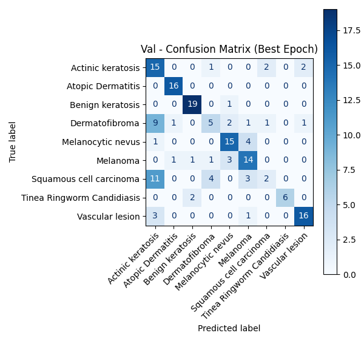

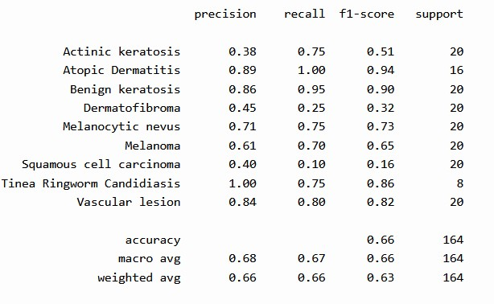

- **Candidato 2: Modelo Estabilizado Intermedio (Regularización Óptima):** Resigna 2.44 puntos de precisión global frente al líder (val*accuracy=63.41%), pero deprime la brecha de sobreajuste a un valor ideal de −0.42%, consolidando un \_Macro F1-Score* de 0.66. El examen desagregado revela la rectificación diagnóstica más significativa: el Recall de _Squamous cell carcinoma_ se incrementa sustancialmente del 10% al **50%**, rompiendo el sesgo ciego y reduciendo las omisiones hacia la queratosis a 6 muestras (contrayendo el Recall de _Actinic keratosis_ a 0.20). En el espectro del _Melanoma_, el modelo compensa la reducción en el Recall (0.60) mediante una ganancia en la especificidad diagnóstica, elevando la precisión al **0.75** y reduciendo los falsos positivos.

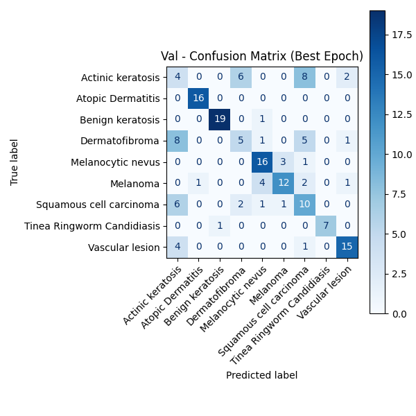

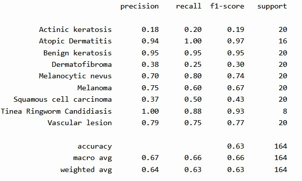

- **Candidato 3: Modelo de Control Menor (Estabilidad Intermedia):** Situada en un escalón inferior (val*accuracy=62.19%, overfitting_gap=0.80%), esta arquitectura valida la degradación de los límites interclase al decrecer la capacidad de generalización. La mejora sobre el carcinoma celular escamoso se anula por completo, convergiendo nuevamente a un Recall del 10% y derivando 9 omisiones hacia la queratosis. La redistribución del error indujo aquí un incremento en el Recall de \_Dermatofibroma* (50%), transformando a esta entidad benigna en un foco secundario de confusión que absorbió erróneamente 7 casos de queratosis y 6 de carcinoma escamoso.

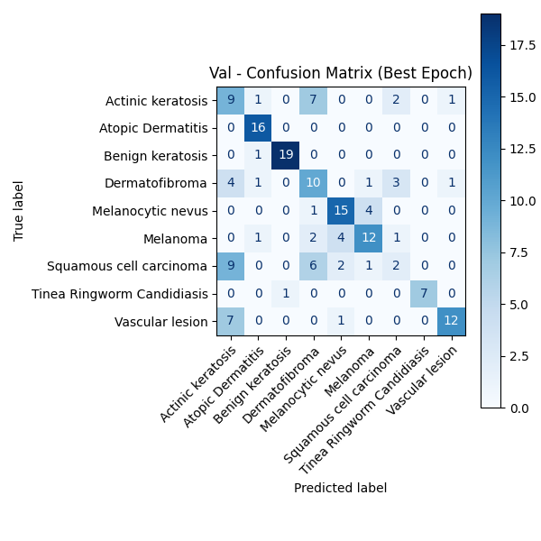

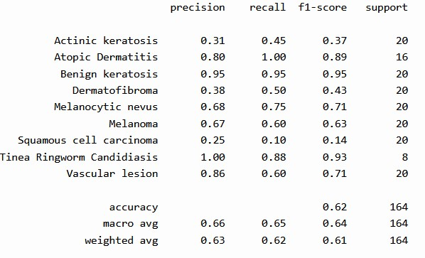

**2\. Veredicto de Selección y Criterio de Optimización Clínica**

La evaluación experimental permite extraer las siguientes conclusiones: Se constata empíricamente la existencia de un límite intrínseco en la arquitectura, denominado técnicamente como el techo del Perceptrón Multicapa (MLP). Los tres casos analizados demuestran de manera empírica que una red densa tradicional encuentra una barrera matemática natural confinada entre el 62% y el 66% de _Accuracy_ al enfrentarse a este conjunto de datos morfológicos. La paridad observada en los valores de _Macro F1-Score_ (0.66, 0.66 y 0.64) confirma que las fluctuaciones al alza en el _Accuracy_ global no representan una ganancia real en la capacidad discriminativa general del sistema, sino variaciones locales y desplazamientos de los sesgos en las fronteras de decisión interclase.

En segunda instancia, la evaluación detecta una marcada complejidad estructural en lo que se define como el "Triángulo de Confusión Histológica", un núcleo persistente de error de clasificación cruzada compuesto por las clases _Actinic keratosis_, _Squamous cell carcinoma_ y _Dermatofibroma_. Debido a que la queratosis es una lesión pre-cancerosa que evoluciona directamente hacia el carcinoma escamoso compartiendo un gran parecido visual, los modelos basados en capas completamente conectadas carecen de los mecanismos de abstracción espacial necesarios para resolver esta frontera visual tan fina. Por consiguiente, el optimizador se ve condicionado a maximizar el rendimiento de una clase específica en detrimento estricto de las remanentes, respondiendo de forma directa a la calibración estocástica de los hiperparámetros.

En tercera instancia, es de destacar la robustez demostrada por el sistema ante clases con muy pocas imágenes de prueba. La clase _Tinea Ringworm Candidiasis_, a pesar de poseer únicamente 8 muestras en el conjunto de validación, se mantuvo firme y no se vio afectada cuando el modelo cambió sus criterios de decisión para las demás enfermedades, sosteniendo valores de F1-score excelentes -comprendidos entre el 0.86 y el 0.93- de manera homogénea en las tres configuraciones analizadas.

Finalmente, bajo la aplicación de principios de optimización clínica y seguridad diagnóstica, **el Candidato 2 (Modelo Estabilizado Intermedio) se consolida como la arquitectura óptima de la investigación**. Si bien esta configuración resigna un margen acotado de 2.44 puntos porcentuales de _Accuracy_ general frente al modelo outlier, la métrica global resulta secundaria ante la robustez y la seguridad epidemiológica que ofrece el sistema regularizado. El Candidato 2 constituye, de los tres modelos analizados, la única solución capaz de balancear las fronteras de decisión interclase, ya que incrementa el _Recall_ del carcinoma escamoso al 50% -reduciendo el peligro de omitir una patología maligna infiltrante-, mitiga la tasa de falsos positivos de _Melanoma_ elevando su precisión al 0.75 -lo que minimiza la sobrecarga hospitalaria y el impacto psicológico de diagnósticos erróneos en el paciente- y garantiza un comportamiento generalizable exento de sobreajuste, respaldado por una brecha matemática de generalización ideal (gap=−0.42%).

No obstante, desde una perspectiva de minimización estricta del riesgo, es imperativo señalar un compromiso crítico (_trade-off_) en este veredicto: la contracción del _Recall_ de _Melanoma_ del 70% (registrado en el Candidato 1) al 60% en esta configuración introduce una vulnerabilidad que no puede ignorarse en la práctica médica real. En enfermedades con altas tasas de mortalidad, un falso negativo (Error de Tipo II) posee un costo asimétrico extremo que pone en riesgo la vida del paciente. Por lo tanto, aunque el Candidato 2 es el modelo más equilibrado matemáticamente dentro de los límites de este experimento, la necesidad de sacrificar la sensibilidad del _Melanoma_ para corregir la ceguera sobre el Carcinoma Escamoso confirma que el sistema ha saturado. Esta fluctuación de errores evidencia que ninguna de las variantes basadas en Perceptrón Multicapa es clínicamente viable por separado para producción, validando la necesidad de dar el salto hacia arquitecturas convolucionales.
