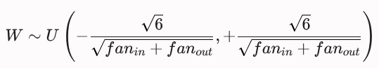
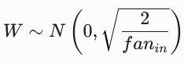

## **1\. Dataset y Preprocesamiento**

**¿Por qué es necesario redimensionar las imágenes a un tamaño fijo para una MLP?**

Es necesario redimensionar las imágenes a un tamaño fijo porque la arquitectura de una MLP (Multilayer Perceptron) posee un diseño estructural rígido. Una vez definida la red, el número de neuronas en la capa de entrada es estático y determina las dimensiones de las matrices de pesos sinápticos (W). Dado que las imágenes se "aplanan" para ingresar como vectores unidimensionales, su longitud total (Ancho x Alto x Canales) debe coincidir exactamente con la cantidad de neuronas de entrada. Si las imágenes tuvieran dimensiones variables, los vectores resultantes cambiarían de tamaño, haciendo que las operaciones algebraicas de multiplicación matricial (X x W) sean matemáticamente imposibles.

**¿Qué ventajas ofrece Albumentations frente a otras librerías de transformación como torchvision.transforms?**

Albumentations permite transformar de forma sincronizada y automática tanto la imagen de entrada, como sus respectivas máscaras de segmentación o "_bounding boxes_", garantizando que las etiquetas espaciales sigan correspondiendo exactamente al contenido visual modificado. Además, ofrece una mayor variedad y complejidad de transformaciones (como distorsiones elásticas o sombras artificiales), lo que permite generar un _Data Augmentation_ más robusto para mejorar la generalización del modelo.

**¿Qué hace A.Normalize()? ¿Por qué es importante antes de entrenar una red?**

Esta función realiza una estandarización de los datos de la imagen canal por canal (Rojo, Verde y Azul). En primer lugar, escala los valores de los píxeles (originalmente en el rango entero de 0 a 255) al rango de punto flotante \[0, 1\] al dividirlos por 255. Luego, a cada píxel de cada canal se le resta la media (\$\\mu\$) y se lo divide por la desviación estándar (\$\\sigma\$) calculadas previamente sobre el dataset (o utilizando valores estándar como los de ImageNet). El resultado matemático de esta operación es la transformación de la matriz de la imagen en un arreglo de NumPy cuyos datos están "centrados en cero", distribuidos en un rango cercano a \$\[-1, 1\]\$.

La normalización es un paso crítico porque optimiza drásticamente la dinámica del entrenamiento y la estabilidad numérica del modelo. Al centrar los datos en cero con una varianza uniforme, se evita que las funciones de activación se saturen y se previene el fenómeno de gradientes explosivos o desvanecientes durante el _Backpropagation_. Estructuralmente, esto suaviza la "superficie de pérdida" (_loss surface_), permitiendo que algoritmos de optimización converjan hacia el mínimo global de forma mucho más rápida y directa.

**¿Por qué convertimos las imágenes a ToTensorV2() al final de la pipeline?**

Convertimos las imágenes mediante ToTensorV2() al final del pipeline principalmente para transformar las matrices de NumPy al "idioma nativo" en el que operan las redes neuronales de PyTorch: los **Tensores** (torch.Tensor). Estructuralmente, esta función realiza una transposición de ejes, reordenando las dimensiones de la imagen desde el formato estándar de Python **HWC** (Alto, Ancho, Canales) hacia el formato **CHW** (Canales, Alto, Ancho), que es el requerido estrictamente por las capas de la red.

Además, esta conversión es fundamental para el aprovechamiento del hardware y el proceso de aprendizaje. Los tensores están optimizados para ser cargados en la **GPU**, permitiendo la aceleración de los cálculos matemáticos en paralelo. Al mismo tiempo, a diferencia de un arreglo común de NumPy, el tensor activa el motor de diferenciación automática (_Autograd_) de PyTorch; esto le permite registrar internamente un historial de todas las operaciones algebraicas que se ejecutan sobre él a lo largo de la red, un requisito indispensable para que el algoritmo de **Backpropagation** pueda calcular los gradientes y actualizar los pesos sinápticos durante el entrenamiento.

## **2\. Arquitectura del Modelo**

**¿Por qué usamos una red MLP en lugar de una CNN aquí? ¿Qué limitaciones tiene?**

Se utiliza una red MLP principalmente por su simplicidad en comparación a una CNN. Las MLP tienen un único tipo de capa (las capas densas), sus operaciones matemáticas se reducen a multiplicaciones de matrices (sin la complejidad del deslizamiento de filtros convolucionales en 2D/3D) y su flujo de datos es estrictamente lineal (o unidireccional). Además, si las imágenes del dataset de patologías de la piel están estandarizadas, recortadas y reducidas a una resolución muy baja, una MLP ofrece una ventaja en términos de simplicidad computacional inicial, permitiendo ejecutar pruebas rápidas para evaluar la dificultad del problema antes de migrar a arquitecturas más complejas.

Para el análisis de imágenes médicas, la MLP presenta limitaciones debido a la pérdida de información espacial. Al tener que "aplanar" la imagen en un vector unidimensional, la red destruye la relación de vecindad entre píxeles, lo que le impide procesar texturas locales, asimetrías y regularidad de los bordes, elementos que son necesarios para, por ejemplo, diagnosticar un melanoma o un lunar benigno. Asimismo, la MLP carece de invarianza a la traslación, lo que significa que si se le entrega a la red dos imágenes con el mismo objeto, pero en distinta posición, podría llegar a interpretar a dichos objetos como distintos. Por último, al ser una arquitectura _fully connected_, presenta una gran cantidad de parámetros; procesar imágenes médicas de mediana resolución generaría millones de conexiones, volviendo al modelo sumamente lento de entrenar y propenso al _overfitting_.

**¿Qué hace la capa Flatten() al principio de la red?**

La capa Flatten() realiza una operación de reestructuración de dimensiones, que transforma una matriz multidimensional (el tensor de la imagen de entrada de tamaño (Alto x Ancho x Canales)) en un arreglo lineal de una sola dimensión. Su función es puramente estructural: no altera los valores numéricos de los píxeles ni posee parámetros entrenables, sino que reorganiza los datos en una lista secuencial.

**¿Qué función de activación se usó? ¿Por qué no usamos Sigmoid o Tanh?**

Funciones de activación en capas ocultas: En las capas ocultas de la arquitectura propuesta se utilizó la función de activación ReLU (Rectified Linear Unit). No se optó por funciones como _Sigmoid_ o _Tanh_ debido a que estas últimas sufren el fenómeno de desvanecimiento del gradiente. Al saturarse en sus extremos, las derivadas de _Sigmoid_ y _Tanh_ se vuelven asintóticamente cercanas a cero, lo que impide que los gradientes fluyan eficazmente hacia las primeras capas durante el _backpropagation_, estancando el aprendizaje. En contraposición, la función ReLU mantiene una derivada constante igual a 1 para cualquier valor de entrada positivo, lo cual mitiga este problema y permite un entrenamiento significativamente más rápido y estable.

Función de activación de salida: Para la capa de salida, correspondiente a un problema de clasificación multiclase, la función teórica requerida es Softmax. Sin embargo, siguiendo las buenas prácticas de PyTorch, el modelo se diseñó para retornar directamente los "_logits"_ (salidas lineales crudas) y se omitió la inclusión explícita de Softmax en la función "_forward"_. Esta separación responde a una estrategia de estabilidad numérica para evitar errores de redondeo por "_overflow"_ o "_underflow"_. Al acoplar los _"logits"_ directamente con la función de pérdida nn.CrossEntropyLoss(), PyTorch fusiona internamente las operaciones de LogSoftmax y NLLLoss mediante optimizaciones algebraicas que previenen imprecisiones matemáticas. Finalmente, dado que Softmax preserva el orden de magnitud de los valores de manera monótona, es posible calcular las predicciones finales aplicando torch.max directamente sobre los "logits", sin necesidad de convertirlos previamente a probabilidades durante el bucle de entrenamiento.

**¿Qué parámetro del modelo deberíamos cambiar si aumentamos el tamaño de entrada de la imagen?**

Si se incrementa el tamaño de resolución de las imágenes de entrada en el pipeline de preprocesamiento, se debe modificar el parámetro input*size en el constructor de la clase MLPClassifier. Al aumentar las dimensiones de la imagen (Alto y Ancho), la capa Flatten() generará un vector unidimensional significativamente más largo. En consecuencia, el argumento in_features de la primera capa densa (nn.Linear) debe actualizarse para que coincida exactamente con el nuevo producto matemático de (Alto x Ancho x Canales). De lo contrario, PyTorch lanzará un error de inconsistencia de dimensiones (\_shape mismatch*) al intentar realizar la multiplicación matricial en el _forward pass_. Cabe destacar que las capas ocultas y de salida subsiguientes no requieren modificaciones, ya que sus dimensiones internas quedan aisladas a partir del tamaño de salida fijado por la primera capa lineal.

## **3\. Entrenamiento y Optimización**

**¿Qué hace optimizer.zero_grad()?**

La función optimizer.zero*grad() se encarga de reiniciar y establecer en cero los gradientes de todos los parámetros entrenables (pesos y sesgos) del modelo al comienzo de cada iteración o \_batch*. Por diseño, PyTorch acumula (suma) los gradientes de manera consecutiva cada vez que se ejecuta el método loss.backward(). Si no se invocara optimizer.zero*grad(), los gradientes del \_batch* actual se sumarían a los de los _batches_ anteriores, distorsionando la dirección del descenso de gradiente y provocando que el optimizador realice actualizaciones de pesos incorrectas, lo que impediría la convergencia del modelo.

**¿Por qué usamos CrossEntropyLoss() en este caso?**

Se utiliza CrossEntropyLoss debido a que el proyecto plantea un problema de clasificación multiclase con categorías mutuamente excluyentes (cada imagen de la piel pertenece a una única patología entre las 10 posibles). Matemáticamente, esta función mide la divergencia entre la distribución de probabilidades predicha por el modelo y la distribución real definida por las etiquetas. Al emplear una escala logarítmica, la entropía cruzada penaliza con mayor severidad aquellas predicciones erróneas en las que el modelo exhibe un alto nivel de confianza, lo cual es fundamental en el diagnóstico médico para forzar una rápida corrección de los errores. Adicionalmente, se selecciona por su eficiencia y estabilidad computacional en PyTorch, ya que al combinar internamente las operaciones de LogSoftmax y NLLLoss, previene imprecisiones por redondeo numérico y optimiza el cálculo de los gradientes durante el entrenamiento.

**¿Cómo afecta la elección del tamaño de batch (batch_size) al entrenamiento?**

La elección del _batch_size_ introduce un compromiso entre la eficiencia de la memoria del hardware y la dinámica de convergencia del modelo, afectando el entrenamiento en dos aspectos principales:

- Gestión de Memoria y Cómputo: Dividir el dataset en mini-batches permite procesar subconjuntos de imágenes en paralelo dentro de los límites de memoria VRAM de la GPU. Un tamaño de _batch_ excesivamente grande puede provocar fallos por falta de memoria, mientras que un tamaño muy pequeño no aprovecha la capacidad de paralelización del hardware, ralentizando el tiempo total de entrenamiento por época.
- Estabilización del Gradiente: Durante el _backpropagation_, la red evalúa el comportamiento de las derivadas parciales de la pérdida respecto a los parámetros, a través de matrices Jacobianas, para cada muestra del _batch_. PyTorch promedia algebraicamente estos resultados para obtener un único vector de gradiente representativo del subconjunto. Un _batch_size_ reducido genera gradientes con alta varianza (ruidosos), lo que introduce un comportamiento estocástico que ayuda a evadir mínimos locales pero dificulta la estabilidad de la convergencia. Por el contrario, un _batch_size_ elevado produce estimaciones del gradiente estables y precisas, pero reduce la naturaleza estocástica del entrenamiento, incrementando el riesgo de que el modelo converja en mínimos locales subóptimos y disminuya su capacidad de generalización ante nuevos datos.

**¿Qué pasaría si no usamos model.eval() durante la validación?**

Si se omite la instrucción model.eval() durante la validación, el modelo permanece en modo de entrenamiento (model.train()). Esto significa que PyTorch mantendrá la red en un estado dinámico y flexible preparado para actualizarse, en lugar de "congelar sus pesos" para realizar inferencias estables.

## **4\. Validación y Evaluación**

**¿Qué significa una accuracy del 70% en validación pero 90% en entrenamiento?**

El desbalance de rendimiento entre validación y entrenamiento, es el indicador de un fenómeno de **sobreajuste** (_overfitting_).

Éste comportamiento manifiesta que la red neuronal dejó de optimizar la detección de patrones generales y comenzó a memorizar el ruido estadístico, las condiciones de iluminación o los artefactos específicos presentes en las imágenes del conjunto de entrenamiento. Al perder su capacidad de generalización, el modelo se vuelve rígido: Demuestra una alta eficacia para clasificar las imágenes con las que fue entrenado, pero exhibe un margen de error elevado al enfrentarse a muestras desconocidas, dentro del marco de validación.

**¿Qué otras métricas podrían ser más relevantes que accuracy en un problema real?**

En un escenario real, particularmente en el ámbito del diagnóstico médico, la métrica de _Accuracy_ (Exactitud) resulta insuficiente y potencialmente falaz. La exactitud evalúa el porcentaje de aciertos globales de manera lineal, otorgándole el mismo peso estadístico a un acierto sobre un tejido sano que a un acierto sobre una lesión maligna.

En bases de datos dermatológicas, donde suele existir un marcado desbalance de clases (por ejemplo, una alta prevalencia de nevos benignos frente a un bajo porcentaje de melanomas), un modelo defectuoso podría alcanzar una alta exactitud simplemente clasificando todas las muestras como benignas. Por lo tanto, en un escenario clínico real, adquieren mayor relevancia las métricas derivadas de la Matriz de Confusión (como _Precision_, _Recall_ y _F1-Score_). Estas permiten segmentar el rendimiento del modelo según la gravedad de las predicciones, priorizando la detección de patologías críticas sobre las clases mayoritarias de control.

**¿Qué información útil nos da una matriz de confusión que no nos da la accuracy?**

Mientras que la _Accuracy_ condensa el rendimiento de la red en un único número que oculta los detalles del comportamiento del modelo, la Matriz de Confusión desglosa los aciertos y los errores específicos para cada clase.

La información crítica que provee la matriz de confusión incluye:

- Asimetría del error: Permite distinguir claramente entre los Falsos Negativos (casos de patologías reales que el modelo omitió, representando el mayor riesgo para la vida del paciente) y los Falsos Positivos (alertas erróneas sobre pacientes sanos, que saturan el sistema de salud y generan intervenciones innecesarias). La _Accuracy_ es ciega a esta diferencia y trata a ambos errores por igual.
- Patrones de confusión interclase: Revela visualmente qué patologías específicas se están confundiendo entre sí (por ejemplo, si el modelo tiende a confundir un tipo de carcinoma con un lunar benigno debido a similitudes de color o textura). Esto permite al desarrollador identificar debilidades en el dataset o en la extracción de características de la red.

**En el reporte de clasificación, ¿qué representan precision, recall y f1-score?**

- Precisión (_Precision_): Representa la exactitud de las predicciones positivas del modelo. Su fórmula matemática es: Precision = VP / (VP + FP)  
   Un valor alto indica que el modelo es altamente confiable cuando emite un diagnóstico positivo, minimizando la tasa de falsas alarmas.
- Sensibilidad (_Recall_): Representa la capacidad del modelo para detectar la totalidad de los casos positivos existentes en el dataset. Su fórmula matemática es: Recall = (VP) / (VP + FN)  
   Un valor elevado es crítico en medicina, ya que garantiza que la tasa de Falsos Negativos (enfermos no detectados) tienda a cero.
- Puntuación F1 (_F1-Score_): Representa la media armónica entre la Precisión y el _Recall_. A diferencia de un promedio aritmético simple, la media armónica penaliza los valores extremos, lo que significa que el _F1-Score_ solo será elevado si ambas métricas base lo son simultáneamente. Su fórmula matemática es:  
   F1-Score = (2 x Precision x Recall) / (Precision+ Recall)  
   Funciona como el indicador definitivo de equilibrio y robustez del modelo ante clases desbalanceadas.

## **5\. TensorBoard y Logging**

**¿Qué ventajas tiene usar TensorBoard durante el entrenamiento?**

El uso de TensorBoard proporciona una interfaz gráfica para el monitoreo, diagnóstico y depuración de modelos de Deep Learning, ofreciendo ventajas críticas frente al registro tradicional por consola:

- Monitoreo dinámico en tiempo real: Permite graficar de manera interactiva las curvas de pérdida (_loss_) y métricas (_accuracy_, _F1-score_) tanto de entrenamiento como de validación. Esto facilita la detección temprana de anomalías como el _overfitting_ o _underfitting_, permitiendo detener entrenamientos infructuosos y optimizar el tiempo de cómputo.
- Diagnóstico de la salud del modelo: Ofrece herramientas para inspeccionar histogramas de pesos, sesgos y gradientes. Esto es fundamental para detectar problemas teóricos complejos como el desvanecimiento o la explosión de gradientes.
- Centralización de experimentos: Funciona como un bitácora digital donde cada ejecución queda registrada de forma independiente, eliminando la necesidad de anotar manualmente los resultados de cada prueba.

**¿Qué diferencias hay entre loguear add_scalar, add_image y add_text?**

Estas funciones representan diferentes tipos de datos estructurados que TensorBoard organiza en pestañas (_tabs_) específicas dentro de su interfaz, cumpliendo roles diferenciados:

- add_scalar: Se utiliza para registrar valores numéricos continuos a lo largo del tiempo (asociados a un paso o época). Es la función ideal para graficar la evolución de pérdidas y métricas de rendimiento. TensorBoard transforma automáticamente estos datos en gráficos de líneas interactivos.
- add_image: Permite enviar tensores de imágenes (matrices de píxeles) para su visualización directa en el tablero.
- add_text: Se usa para registrar cadenas de caracteres o texto en formato Markdown. Su propósito es documentar metadatos fijos del experimento dentro del mismo log, tales como la arquitectura del modelo, la configuración de hiperparámetros (hiperparámetros de optimización, tasa de aprendizaje inicial) o notas sobre el origen del dataset.

**¿Por qué es útil guardar visualmente las imágenes de validación en TensorBoard?**

En un proyecto de clasificación de patologías de la piel, guardar visualmente las imágenes durante la etapa de validación (junto con su etiqueta real y la predicción del modelo) aporta lo siguiente:

- Evaluación cualitativa del error: Permite realizar un análisis visual de los casos donde el modelo falla. Por ejemplo, ayuda a identificar si los Falsos Negativos ocurren debido a condiciones específicas de la imagen (mala iluminación, presencia de vello corporal, artefactos del lente) o si el modelo está confundiendo características morfológicas muy sutiles entre dos patologías similares.
- Validación del preprocesamiento: Asegura que las imágenes modificadas por las técnicas de aumento de datos (_data augmentation_) o normalización sigan siendo reconocibles y no hayan perdido la información patológica esencial antes de ingresar a la red.
- Interpretación clínica: Facilita la presentación de resultados ante expertos del dominio médico, permitiendo mostrar ejemplos concretos de aciertos y fallos para generar confianza en los criterios del algoritmo.

**¿Cómo se puede comparar el desempeño de distintos experimentos en TensorBoard?**

- Superposición automática de curvas: Si se guardan diferentes ejecuciones (_runs_) en subdirectorios dentro de la carpeta principal de logs, TensorBoard las detecta automáticamente. Al abrir la pestaña de escalares, el sistema superpone las curvas de pérdida o _accuracy_ de todos los experimentos en un mismo gráfico, asignándole un color único a cada uno para evaluar cuál logró converger más rápido o alcanzó mejor rendimiento.
- Filtrado y selección adaptativa: La barra lateral izquierda permite activar o desactivar experimentos específicos mediante "_checkboxes"_, facilitando el aislamiento de pruebas puntuales (por ejemplo, comparar únicamente el Experimento A con _batch_size=32_ frente al Experimento B con _batch_size=128_).
- Suavizado de curvas (_Smoothing_): Permite aplicar un filtro de media móvil a los gráficos de líneas. Esto es muy útil para reducir el ruido visual de los gráficos (especialmente cuando se entrena con _batches_ chicos) y poder comparar con claridad la tendencia real de convergencia entre distintos modelos.

## **6\. Generalización y Transferencia**

**¿Qué cambios habría que hacer si quisiéramos aplicar este mismo modelo a un dataset con 100 clases?**

Para escalar el modelo actual a un problema de 100 clases, se debe realizar lo siguiente: En la definición de la clase MLPClassifier, se debe cambiar el argumento num*classes de 9 a 100. Esto modificará la última capa lineal del nn.Sequential, para que así la red genere un vector de 100 "\_logits"*, permitiendo que la función nn.CrossEntropyLoss() evalúe la probabilidad correspondiente a cada una de las 100 categorías.

**¿Por qué una CNN suele ser más adecuada que una MLP para clasificación de imágenes?**

Las Redes Convolucionales (CNN) superan a las Perceptrones Multicapa (MLP) en el procesamiento de imágenes debido a tres principios arquitectónicos fundamentales:

- Invariancia espacial y preservación de la topología: La MLP requiere aplanar la imagen (nn.Flatten()), transformando la matriz bidimensional en un vector unidimensional. Al hacer esto, la MLP destruye la vecindad espacial de los píxeles (la relación de arriba, abajo, izquierda y derecha). La CNN, mediante operaciones de convolución, procesa la imagen manteniendo su estructura bidimensional, lo que le permite extraer patrones locales como bordes, texturas y formas.
- "_Weight Sharing_": En una MLP, cada neurona de la primera capa oculta se conecta con todos los píxeles de la entrada; si las dimensiones (ancho y alto) de la imagen se duplican, el número de parámetros se cuadruplicará debido a la relación cuadrática del espacio bidimensional. En una CNN, los filtros (kernels) se deslizan por toda la imagen reutilizando los mismos pesos matemáticos. Esto reduce drásticamente el número de parámetros entrenables, haciendo al modelo más eficiente y menos propenso al _overfitting_.
- Invariancia a la traslación: Debido a la naturaleza del deslizamiento de los filtros y las capas de _Pooling_, una CNN puede reconocer una patología de la piel sin importar si la lesión se encuentra en el centro, en una esquina o rotada dentro de la imagen. Una MLP, al ser rígida, necesitaría ver la misma lesión en todas las posiciones posibles del entrenamiento para aprender a reconocerla.

**¿Qué problema podríamos tener si entrenamos este modelo con muy pocas imágenes por clase?**

Entrenar un modelo con un volumen de datos sumamente reducido por clase expone al sistema a dos problemas:

- Alto riesgo de Sobreajuste (_Overfitting_): Al disponer de pocas muestras, el modelo carecerá de variabilidad estadística. Dada la alta cantidad de parámetros de la MLP, la red optará por memorizar los detalles exactos, el ruido de fondo o las condiciones de iluminación particulares de esas pocas fotos (alcanzando un error cercano a cero en el entrenamiento), en lugar de abstraer las características clínicas reales de la patología. Al evaluar datos nuevos, el rendimiento colapsará.
- Sesgo de muestreo y falta de representatividad: En dermatología, una misma patología puede manifestarse de formas muy diversas según el fototipo de piel del paciente, el tiempo de evolución o la localización anatómica. Un dataset reducido no logra capturar esta variabilidad biológica. En consecuencia, el modelo desarrollará un sesgo severo, quedando incapacitado para generalizar de forma robusta en un entorno clínico real. En otras palabras, aunque el modelo no presentara "overfitting", seguiría siendo incapaz de generalizar porque nunca "vio" las otras formas en las que la enfermedad se presenta en el mundo real.

**¿Cómo podríamos adaptar este pipeline para imágenes en escala de grises?**

Para procesar imágenes en escala de grises (un solo canal de color en lugar de los tres canales RGB), se deben ajustar el pipeline de carga de datos y la dimensión de entrada del modelo:

- Adaptación en la carga y preprocesamiento (Transforms): Se debe modificar la lectura de las imágenes para que se procesen en un único canal. Si se utiliza torchvision.transforms, se debe añadir transforms.Grayscale(num*output_channels=1). En caso de utilizar \_Albumentations*, se configura el lector o se aplica la transformación ToGray(). Esto cambia las dimensiones de la imagen de (H, W, 3) a (H, W, 1).
- Modificación del parámetro de entrada en el modelo: Al reducirse los canales a uno, el volumen de datos que genera la capa nn.Flatten() se reduce a la tercera parte. Por lo tanto, al instanciar el modelo, el argumento input_size debe actualizarse matemáticamente: Nuevo Input Size = Alto x Ancho x 1

## **7\. Regularización**

**¿Qué es la regularización en el contexto del entrenamiento de redes neuronales?**

En el marco del entrenamiento de redes neuronales, la regularización se define como cualquier modificación que se realiza sobre el algoritmo de aprendizaje con el objetivo explícito de reducir su error de generalización (test/validación) sin buscar disminuir su error de entrenamiento.

Su propósito fundamental es mitigar el fenómeno de sobreajuste (_overfitting_). Cuando un modelo posee una alta capacidad (es decir, una gran cantidad de parámetros entrenables en relación con el volumen de datos), tiende a memorizar el ruido estadístico, las particularidades de la iluminación o los artefactos del conjunto de entrenamiento. Las técnicas de regularización introducen restricciones matemáticas, perturbaciones o penalizaciones en el flujo de entrenamiento para limitar la flexibilidad del modelo. Esto fuerza a la red a converger hacia soluciones más robustas, asegurando que las fronteras de decisión aprendidas se basen en características morfológicas generales y extrapolables a muestras clínicas inéditas.

**¿Cuál es la diferencia entre Dropout y regularización L2 (weight decay)?**

La diferencia radica en su mecanismo de acción: la regularización L2 opera de forma determinista modificando la función de pérdida mediante una penalización cuadrática que obliga a todos los pesos a mantener valores pequeños y cercanos a cero, evitando que ninguna característica domine el modelo. Por el contrario, Dropout es una técnica estocástica que, durante cada paso del _forward pass_, desactiva aleatoriamente un porcentaje de neuronas junto con sus conexiones. Esto rompe las coadaptaciones entre neuronas y fuerza a la red a aprender representaciones redundantes y robustas, actuando como un ensamble implícito de múltiples subredes.

**¿Qué es BatchNorm y cómo ayuda a estabilizar el entrenamiento?**

_Batch Normalization_ (BatchNorm) es una técnica que normaliza las activaciones de las capas ocultas dentro de cada _mini-batch_, asegurando que tengan una media de cero y una varianza de uno, para luego aplicar un escalado y un desplazamiento que la red aprende dinámicamente. Esta operación estabiliza el entrenamiento al mitigar el problema del Desplazamiento de Covarianza Interna (_Internal Covariate Shift_), que es la alteración constante de la distribución de las entradas de una capa debido a los cambios de pesos en las capas previas. Al mantener las escalas estables, evita que las señales colapsen o exploten a lo largo de la arquitectura.

**¿Cómo se relaciona BatchNorm con la velocidad de convergencia?**

BatchNorm incrementa drásticamente la velocidad de convergencia porque permite utilizar tasas de aprendizaje (_learning rates_) mucho más altas sin riesgo de divergencia o inestabilidad numérica. Al suavizar la superficie de la función de pérdida y garantizar que las activaciones no caigan en las zonas de saturación de las funciones de activación (donde las derivadas se vuelven casi cero), los gradientes fluyen con mayor fuerza y consistencia a través de la red, reduciendo significativamente el número de épocas requeridas para que el modelo alcance un rendimiento óptimo.

**¿Puede BatchNorm actuar como regularizador? ¿Por qué?**

Sí, BatchNorm actúa como un regularizador suave debido a un efecto secundario inherente a su diseño: el cálculo de la media y la varianza se realiza de forma exclusiva para cada _mini-batch_ en lugar de usar todo el dataset. Como cada lote es un subconjunto aleatorio de datos, introduce un pequeño ruido estocástico en las activaciones de la red. Este ruido actúa como una perturbación constante durante el entrenamiento, lo que dificulta que el modelo se sobreajuste a los detalles específicos de las muestras individuales, logrando un impacto similar al de técnicas como Dropout.

**¿Qué efectos visuales podrías observar en TensorBoard si hay overfitting?**

En TensorBoard, el _overfitting_ se identifica mediante el comportamiento divergente de las curvas de las métricas. En el gráfico de la función de pérdida (_loss_), se observará que la curva de entrenamiento continúa descendiendo suavemente hacia cero, mientras que la curva de validación se estanca o comienza a subir notablemente a partir de cierta época. En los gráficos de rendimiento, como el _Accuracy_, se apreciará una brecha (_gap_) significativa y creciente entre la precisión de entrenamiento (cercana al 100%) y la de validación, la cual se estabiliza en un valor mucho más bajo.

**¿Cómo ayuda la regularización a mejorar la generalización del modelo?**

La regularización mejora la generalización al restringir el espacio de hipótesis que la red puede explorar, impidiendo que el modelo se vuelva excesivamente complejo y se adapte al ruido específico del conjunto de entrenamiento. Al penalizar los pesos grandes (L2), desactivar nodos aleatoriamente (Dropout) o estabilizar las distribuciones (BatchNorm), se fuerza al optimizador a encontrar soluciones basadas en las características morfológicas más esenciales y repetitivas de los datos. Esto disminuye la varianza del modelo y garantiza que las fronteras de decisión aprendidas sigan siendo válidas al enfrentarse a datos nuevos que el sistema nunca antes vio.

## **8\. Inicialización de Parámetros**

**¿Por qué es importante la inicialización de los pesos en una red neuronal?**

La inicialización de los pesos define el punto de partida del optimizador en el paisaje de pérdida y condiciona el flujo de señales matemáticas. Su importancia radica en tres pilares fundamentales:

- Ruptura de la simetría: Si los parámetros se inicializan con un valor constante uniforme (por ejemplo, todos en cero), todas las neuronas de una misma capa oculta computarán activaciones idénticas y recibirán gradientes equivalentes durante el _backpropagation_. Esto anula la capacidad de la red para aprender características diferenciadas, haciendo que múltiples neuronas actúen como una sola. La inicialización aleatoria es necesaria para romper esta simetría y permitir el aprendizaje representacional.
- Estabilización de la varianza (Gradientes estables): La propagación de datos a través de múltiples capas implica multiplicaciones matriciales sucesivas. Pesos iniciales excesivamente grandes provocan una explosión de las activaciones y gradientes, llevando al sistema a la inestabilidad numérica (NaN). Por el contrario, pesos demasiado pequeños inducen un desvanecimiento del gradiente (_vanishing gradient_), donde la señal se atenúa capa tras capa hasta impedir que las primeras capas actualicen sus pesos.
- Prevención de la saturación de activaciones: Valores iniciales inadecuados pueden forzar a que las entradas de las funciones de activación (como _Sigmoid_ o _tanh_) se ubiquen en sus regiones asintóticas o planas. En estas zonas, las derivadas parciales tienden a cero, lo que bloquea la transferencia de gradientes durante el entrenamiento y congela el aprendizaje del modelo.
  
**¿Qué podría ocurrir si todos los pesos se inicializan con el mismo valor?**

Si todos los pesos de una red neuronal se inicializan con un mismo valor constante, el sistema sufre una pérdida total de la capacidad de representación debido al fenómeno de **simetría matemática**. Las consecuencias específicas de este estado son:

- Simetría en el _Forward Pass_: Al poseer coeficientes idénticos, todas las neuronas de una capa oculta determinada procesarán las entradas de la capa anterior de la misma manera, generando un valor de activación exactamente igual para cada una de ellas ante una misma muestra.
- Simetría en el _Backpropagation_: Durante la propagación del error hacia atrás, las derivadas parciales de la función de pérdida respecto a cada peso serán equivalentes dentro de la misma capa. En consecuencia, el vector de gradientes aplicará una corrección idéntica para todos los parámetros de dicha capa.
- Colapso de la dimensionalidad: Dado que los pesos se actualizan de manera perfectamente síncrona y homogénea época tras época, las neuronas se transforman en "clones" matemáticos. Aunque la arquitectura disponga de capas densas con cientos de unidades, el modelo operará como si tuviera una única neurona por capa, restringiendo su frontera de decisión a la de un clasificador lineal e induciendo un estado de subajuste (_underfitting_).
  
**¿Cuál es la diferencia entre las inicializaciones de Xavier (Glorot) y He?**

La diferencia fundamental radica en cómo calculan la varianza de los pesos según la función de activación utilizada para evitar la inestabilidad de los gradientes.

La **Inicialización de Xavier (Glorot)** se aplica en capas con funciones de activación lineales o simétricas respecto al cero (como Tangente Hiperbólica o Sigmoide). Su objetivo es mantener constante la varianza de los datos en ambos sentidos de la red. Para ello, calcula los pesos considerando tanto el número de entradas (fanin​) como el de salidas (fanout​) de la capa específica. En su versión uniforme, los valores se extraen del intervalo:

Por el contrario, la **Inicialización de He (Kaiming)** está diseñada para activaciones no lineales y asimétricas que anulan los valores negativos, como la función ReLU. Como ReLU apaga estadísticamente a la mitad de las neuronas en cada paso, He duplica la varianza de los pesos para compensar esa pérdida de información. Además, simplifica el cálculo al ignorar el número de salidas (fanout​) y basarse únicamente en las entradas (fanin​) de la capa. En su versión normal, los pesos se extraen de:

**¿Por qué en una red con ReLU suele usarse la inicialización de He?**

La función ReLU (f(x)=max(0,x)) anula todas las entradas negativas, lo que provoca que, estadísticamente, la mitad de las neuronas de una capa se desactiven en cada _forward pass_. Si se utilizara la inicialización de Xavier (que asume que todas las neuronas transmiten señal), la varianza de las activaciones se reduciría a la mitad en cada capa sucesiva debido a este bloqueo. En redes profundas, esta pérdida acumulativa haría que la varianza colapsara rápidamente hacia cero, desencadenando el desvanecimiento del gradiente y deteniendo el aprendizaje en las primeras capas.

La inicialización de He contrarresta este fenómeno modificando el cálculo de la varianza mediante la introducción de un factor multiplicador de 2 ($σ^{2}=\frac{2}{f_{an_{in}}}$​). Al escalar los pesos iniciales para hacerlos ligeramente más grandes, se compensa de forma exacta ese 50% de neuronas que la función ReLU apaga. Esto garantiza que la varianza de la señal y de los gradientes permanezca estable a lo largo de toda la arquitectura, permitiendo un entrenamiento fluido.

**¿Qué capas de una red requieren inicialización explícita y cuáles no?**

Capas que requieren inicialización explícita: Son aquellas que poseen parámetros entrenables que alteran activamente la magnitud de los tensores. Para el modelo MLP, estas capas son las lineales (nn.Linear). En modelos más avanzados, también requieren inicialización las capas convolucionales (nn.Conv2d) y las capas de normalización de características (nn.BatchNorm2d).

Capas que no requieren inicialización: Son capas netamente estructurales u operaciones matemáticas fijas que no poseen tensores de pesos internos, por lo que no hay parámetros que inicializar. Ejemplos de esto en tu pipeline son:

- Capas de aplanado (nn.Flatten).
- Funciones de activación (nn.ReLU, nn.Sigmoid).
- Capas de regularización por descarte (nn.Dropout).
- Capas de reducción espacial (nn.MaxPool2d o nn.AvgPool2d).
