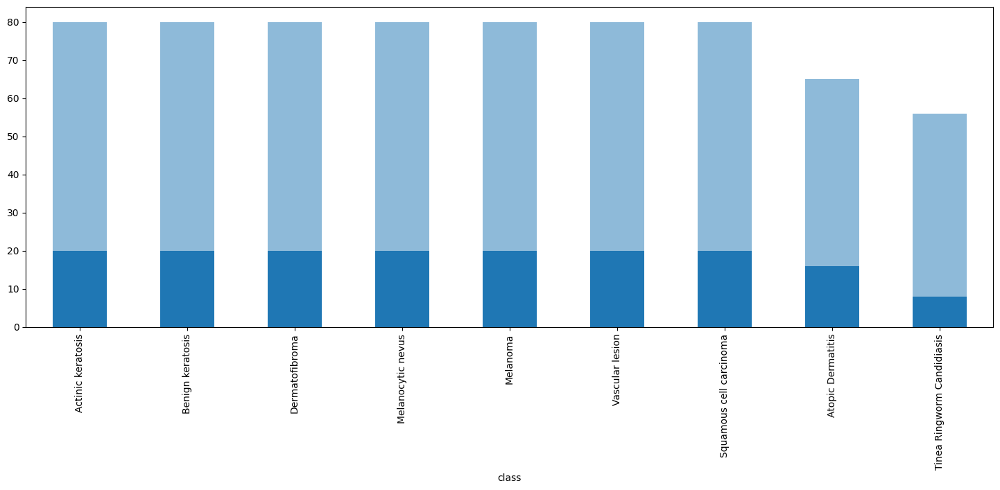

## Resumen 
El presente informe detalla el proceso iterativo de diseño, evaluación y optimización de una arquitectura de red neuronal convolucional (CNN) basada en la topología AlexNet para el diagnóstico predictivo sobre un conjunto de datos médicos de lesiones cutáneas. Frente a las limitaciones de volumen típicas en conjuntos de datos, se implementó una estrategia de *grid search* y poda en embudo para estabilizar el gradiente, mitigar el subajuste y acorralar el modelo óptimo de generalización.

---

## Cuadro Comparativo de Rendimiento General

| Fase del Experimento | Modelos Evaluados | Enfoque Metodológico Central | Máx. Val Accuracy | Comportamiento del Overfitting Gap |
| :--- | :---: | :--- | :---: | :---: | 
| **1. Exploración Base** | 192 | AlexNet MaxPool tradicional. | ~60.3% | Altamente negativo (hasta -15%) | 
| **2. Rediseño Estructural** | 64 | Poda de hiperparámetros + Reducción por Convolución (Stride=2). | **~62.0%** | Estabilización con el aumento del *Accuracy* | 

---

## Análisis de Fases Experimentales

### Fase 1: Exploración de Hiperparámetros (192 Modelos)
La primera fase consistió en una búsqueda orientada a mapear la sensibilidad de la AlexNet tradicional ante variaciones de *Learning Rate*, *Batch Size*, *dropout* y técnicas de aumentación de datos (como el módulo de brillo y contraste aleatorio, rotaciones, *Shift*, entre otros). 

Los resultados revelaron un fenómeno de **subajuste crónico inducido**. Un análisis retrospectivo indica que éste comportamiento podría haber sido causado por la acción simultánea de dos factores de diseño:
* Por un lado, una posible pérdida de contexto espacial en las capas terminales del extractor convolucional, donde el uso de un MaxPool estático redujo las matrices de activación, limitando la retención de características críticas (como bordes y asimetrías).
* Por el otro, una regularización e inducción de ruido excesiva en los canales de color (mediante la aumentación de brillo y contraste), distorsionando una variable médica esencial (Score ABCD).

* **Figura 1**: Mapa de dispersión (Validation Accuracy vs. Overfitting Gap) de la primera grilla (192 modelos). Se observa una dispersión caótica con una marcada tendencia hacia gaps negativos de hasta -15% en precisiones elevadas, denotando el subajuste provocado por la pérdida de contexto.*

---

### Fase 2: Ajuste Estructural por Convolución Estratégica (64 Modelos)
A partir de los datos de la Fase 1, se aplicó un criterio de poda jerárquica para reconfigurar la red, reduciendo el espacio de búsqueda a 64 combinaciones controladas:
* **Desactivación del Ruido Lumínico:** Se eliminó la manipulación de brillo y contraste, devolviendo la fidelidad cromática al set.
* **Introducción del Bloque Paramétrico (Conv2D con Stride=2):** Se reemplazó el último bloque de `MaxPool` por una capa convolucional con paso (*stride*) igual a 2. Matemáticamente, esto permite que la red aprenda los pesos de filtrado idóneos para resumir el contexto espacial, en lugar de realizar una operación de máximo estática.

* **Figura 2**: Mapa de dispersión tras el rediseño de arquitectura (64 modelos). Nótese el achatamiento drástico de la nube de puntos y cómo los modelos se concentran de forma saludable sobre el eje del cero, logrando una transferencia transparente del aprendizaje hacia el set de validación.*

---

## 4. Conclusiones Técnicas
El entrenamiento de redes profundas *desde cero (from scratch)* con muestras limitadas impone restricciones en la capacidad de generalización. Alcanzar un **62.0% de Accuracy en Validación** con un comportamiento del gap estabilizado representa una validación metodológica exitosa:
1. Demuestra que delegar el submuestreo espacial a capas convolucionales parametrizadas (`Stride`) preserva los patrones diagnósticos con mayor eficacia que los métodos de *pooling* clásicos.
2. El proceso de optimización en embudo guiado por MLflow permitió aislar el *sweet spot* de la red (`Learning Rate = 0.001`), aproximando a esta CNN al techo histórico del dataset obtenido mediante Perceptrones Multicapa (66%).
